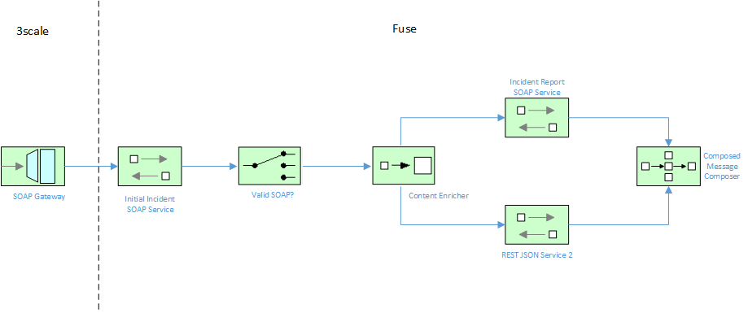

Contract First Web Service Development
====================================

This project exposes a single coarse grained service endpoint as a composition of several backing fine-grained services, as illustrated by the following diagram:



## Overview

The steps demonstrated by this project can be detailed as follows:

### 1.1 Exposed Endpoint

1. Service takes six input parameters
2. Validate input SOAP using XSD or WSDL
3. Extract three elements from input
4. Create SOAP payload from extracted elements and send it out to SOAP Service 1
5. If above call returns error return a well formed error back to caller
6. Create JSON payload from remaining three elements and sent it out to JSON Service 2
7. Parse above calls JSON output and Transform it to SOAP
8. Combine above with SOAP Service 1 call response and create final SOAP output then send it out

### 1.2 SOAP Service 1

1. Accept SOAP input payload and validate it
2. Transform it to JSON and log it
3. Return a success SOAP response

### 1.3 JSON Service 2

1. Accept JSON input payload and validate it
2. Transform it to XML and log it
3. Return a success JSON response


## Prerequisites

The project runs as a standalone Java process using SpringBoot.

The following are required to run this project:

1. JDK 1.8 or newer
2. Maven 3.3 or newer

Also make sure that both backend API's are running in the background ([code-first REST](./codefirst-rest-service) and [code-first SOAP](./codefirst-soap-service)).

### Building


1. Update the `support\sample-settings.xml` file with your local maven respository path (located on line 3)

## Deployment

This project can be deployed using the followng method:

* Standalone Spring-Boot container

### Standalone Spring Boot Container

The standalone method takes advantage of the [Camel Spring Boot Plugin](http://camel.apache.org/spring-boot.html) to build and run the microservice.

Execute the following command from the root project directory:

```
mvn -s support/sample-settings.xml spring-boot:run
```

Once the spring boot service has started, you can test the SOAP service using a tool such as PostMan or SOAPUI.  The WSDL should be accessible from here: `http://localhost:9393/cxf/incident?wsdl`.  A sample request payload is below:

```xml
<soapenv:Envelope xmlns:soapenv="http://schemas.xmlsoap.org/soap/envelope/" xmlns:init="http://initialincident.example.camel.apache.org">
   <soapenv:Header/>
   <soapenv:Body>
      <init:inputInitialIncident>
         <incidentDate>2017-02-02</incidentDate>
         <givenName>Citizen</givenName>
         <familyName>Jane</familyName>
         <details>BlahBlah</details>
         <email>jane.citizen@gmail.com</email>
         <phone>111-111-1111</phone>
      </init:inputInitialIncident>
   </soapenv:Body>
</soapenv:Envelope>
```

If the service completes normally after calling the backend REST and SOAP services, you should be returned with the following positive response message:

```xml
<soap:Envelope xmlns:soap="http://schemas.xmlsoap.org/soap/envelope/">
   <soap:Body>
      <ns2:outputInitialIncident xmlns:ns2="http://initialincident.example.camel.apache.org">
         <code>3</code>
         <soapServiceOneStatus>OK</soapServiceOneStatus>
         <jsonServiceTwoStatus>Received</jsonServiceTwoStatus>
      </ns2:outputInitialIncident>
   </soap:Body>
</soap:Envelope>
```